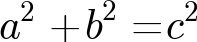
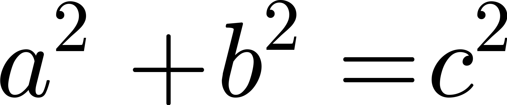

MathAppData
===
 

This repository holds the data that is used by MathApp.

Pipeline
---
This repository consists of two stages beta and master. All changes should be merged into the beta branch. Travis will then run all the test and regenerate the images for the equations. If nothing fails, all changes will be published to the master branch

DPI Sizes
---
Four different versions of each image is generated in order to have approriate image sized for devices with different screen densities. The four different dpi levels are shown below
### ldpi

### mdpi

### hdpi

### xhdpi

